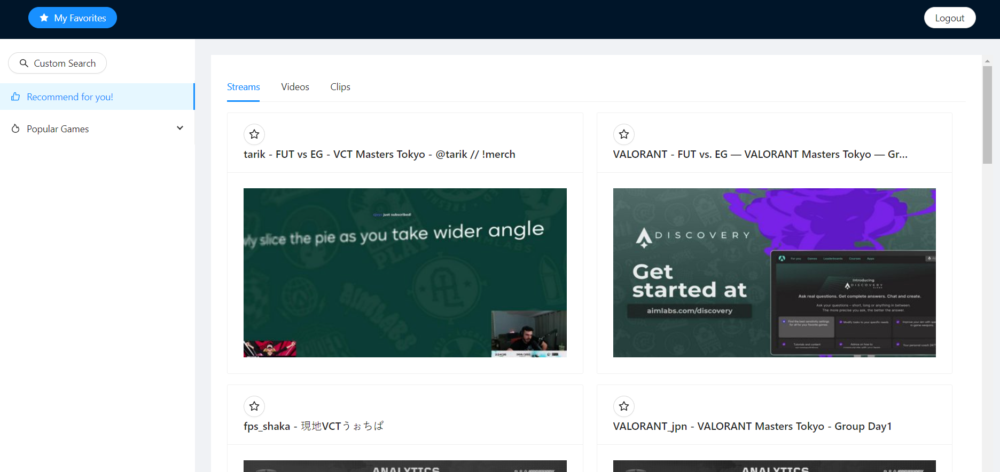

# Twitch-Platform-App
This is an app designed to clone the idea of Twitch using Twitch API. The idea is to implement a content based recommendation system on a web-app, where it takes the search history and favorite record as parameters to recommend stream/clips/videos.

## Overview
### About this Project
1. Design Phase: Used Figma to design the UI.
2. Frontend: Used React JS and Ant Design React library.
3. Backend: Used Spring MVC and Java Servelet on game service queries.
4. Databases: Used MySQL and connect with Spring Hibernate.
5. Deployment: Deployed to Amazon EC2 for better performance.
6. Fetures: Signup, Login, Search Twitch resources(Stream/Clips/Videos), Get Recommendation.

### Purpose / Critical User Journey
1. want to Gain Practice on using Spring in web-application
2. The current recommendation system that Twitch used does not fit my personal preferrence.

### Screenshot

### Links
* Link      : [website](http://3.145.56.163/)
* Solution  : [@Github](https://github.com/catfish0w0/twitch-platform-app)

## MyProcess
### Built With
* React JS and Ant Design
* Twitch API
* Intellij, Java Servelet, Spring MVC and Hibernate
* MySQL
* Docker
* Apache
* Amazon RDS
* Amazon EC2

### Continued Development
I would like to improve on.
* the UI can be polished a bit.
* improved the speed that can load the Twitch resources.
* implement two-factor authentication on the login function.

### Useful Resources
* [Ant Design](https://ant.design/docs/react/introduce)
* [Twitch API](https://dev.twitch.tv/docs/api/)
* [Amazon RDS](https://aws.amazon.com/rds/)
* [Amazon EC2](https://aws.amazon.com/ec2/)

